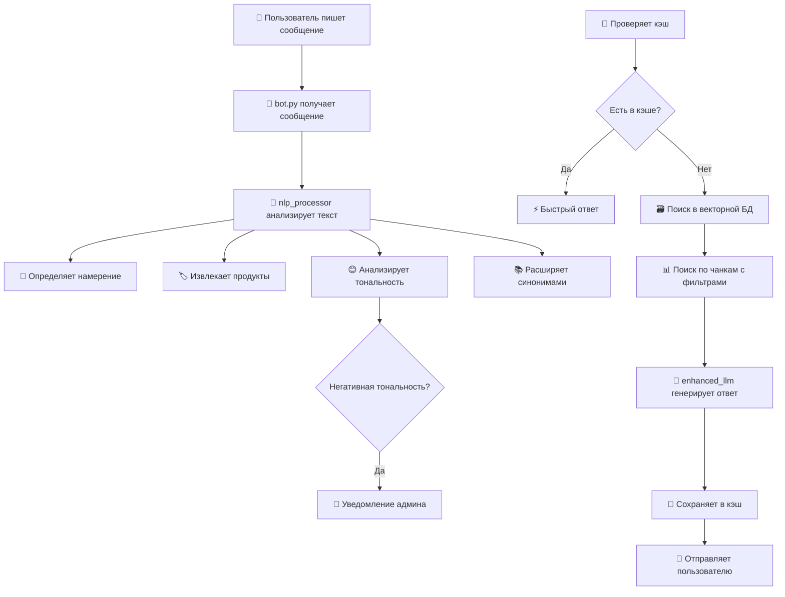

# 🔧 Техническое руководство администратора: Архитектура и управление ботом

## 📋 Содержание
1. [Архитектура бота](#архитектура-бота)
2. [Как работает обработка сообщений](#обработка-сообщений)
3. [Управление базой знаний](#управление-базой-знаний)
4. [Настройка NLP компонентов](#настройка-nlp)
5. [Мониторинг и диагностика](#мониторинг)
6. [Решение проблем](#решение-проблем)

---

## 🏗️ Архитектура бота

### Структура файлов и их назначение

```
AUR_bot/
├── bot.py                    # 🤖 Основной файл бота (Telegram интерфейс)
├── nlp_processor.py          # 🧠 NLP обработка (намерения, сущности, синонимы)
├── enhanced_vector_db.py     # 🗃️ Векторная база данных с чанками
├── enhanced_llm.py          # 🤖 Умная обработка через LLM
├── knowledge_base.json       # 📚 База знаний о продуктах
├── database.py              # 💾 База данных пользователей
├── .env                     # 🔐 Конфиденциальные настройки
└── requirements.txt         # 📦 Зависимости Python
```

### Компоненты системы

#### 1. **Telegram Bot (bot.py)**
- Принимает сообщения от пользователей
- Обрабатывает команды и callback'и
- Отправляет ответы и уведомления админу

#### 2. **NLP Processor (nlp_processor.py)**
- **Intent Classifier**: распознает намерения пользователя
- **Entity Recognizer**: находит названия продуктов в тексте
- **Sentiment Analyzer**: определяет эмоциональную окраску
- **Synonym Manager**: работает с синонимами

#### 3. **Enhanced Vector DB (enhanced_vector_db.py)**
- Разбивает продукты на смысловые чанки
- Создает векторные представления текста
- Выполняет семантический поиск
- Кэширует популярные ответы

#### 4. **Enhanced LLM (enhanced_llm.py)**
- Формирует контекст для AI модели
- Использует специализированные промпты
- Генерирует персонализированные ответы

---

## ⚙️ Как работает обработка сообщений

### Пошаговый алгоритм:



### Детальный процесс:

#### Этап 1: Анализ сообщения
```python
# Пример: "Что принимать при простуде?"
processed_message = nlp_processor.process_message(text)

# Результат:
# - intent: подбор_по_проблеме
# - entities: [] (нет продуктов)
# - sentiment: neutral
# - expanded_query: "простуда ОРВИ грипп насморк кашель..."
```

#### Этап 2: Стратегия поиска
```python
# Для намерения "подбор_по_проблеме" - немедленный поиск
if intent == "подбор_по_проблеме":
    search_results = enhanced_vector_db.search_by_use_case(expanded_query)
    
# Для "вопрос_о_составе" - поиск только в чанках состава
elif intent == "вопрос_о_составе":
    search_results = enhanced_vector_db.search(query, filters={"chunk_type": "composition"})
```

#### Этап 3: Генерация ответа
```python
# LLM получает специализированный промпт в зависимости от намерения
system_prompt = get_system_prompt_for_intent(intent)
context = build_context_from_search_results(search_results)
answer = llm.generate_response(question, context, system_prompt)
```

---

## 📚 Управление базой знаний

### Структура файла knowledge_base.json

```json
[
  {
    "id": "solberry_h",                    // Уникальный ID продукта
    "product": "Солберри-H (Solberry-H)",  // Полное название
    "category": "Антиоксиданты",           // Категория для фильтрации
    "form": "90 капсул, массой 450 мг",    // Форма выпуска
    "description": "Описание продукта...", // Общее описание
    "benefits": [                          // Показания (массив строк)
      "при частых простудах, гриппе, ангинах",
      "при умственных и физических нагрузках",
      "при гиповитаминозах"
    ],
    "composition": "состав продукта...",   // Состав
    "dosage": "по 1-2 капсуле в день...", // Способ применения
    "duration": "30 дней",                // Длительность курса
    "contraindications": "индивидуальная непереносимость...",
    "nutrition_per_100g": "белки – 8,5 г...", // Пищевая ценность
    "energy": "410,8 ккал/1718,8 кДж",    // Энергетическая ценность
    "storage": "при температуре от 0ºС до +25ºС...", // Хранение
    "shelf_life": "2 года",               // Срок годности
    "special_note": "Допускается слеживание..." // Особые примечания
  }
]
```

### Как бот обрабатывает базу знаний

#### Автоматическое разбиение на чанки:
```python
# Каждый продукт создает 5 типов чанков:

1. "description" - общее описание
   Текст: "Оздоравливающий напиток на основе сухого концентрированного сока облепихи..."

2. "benefits" - показания к применению
   Текст: "Показания к применению: при частых простудах, гриппе, ангинах; при умственных и физических нагрузках..."

3. "composition" - состав
   Текст: "Состав: cок облепихи сухой концентрированный, мальтодекстрин..."

4. "dosage" - способ применения
   Текст: "Способ применения: по 1-2 капсуле в день во время еды, курс 30 дней"

5. "contraindications" - противопоказания
   Текст: "Противопоказания: индивидуальная непереносимость компонентов продукта"
```

#### Метаданные для каждого чанка:
```python
metadata = {
    "category": "Антиоксиданты",
    "use_cases": ["простуда", "усталость", "иммунитет"],
    "for_whom": ["взрослые"],
    "product_id": "solberry_h",
    "source": "knowledge_base.json"
}
```

### Правила наполнения базы знаний

#### ✅ **Обязательные поля:**
- `id` - уникальный идентификатор (латиницей, без пробелов)
- `product` - полное название продукта
- `category` - категория продукта
- `description` - описание (минимум 100 символов)
- `benefits` - массив показаний (минимум 3 пункта)
- `composition` - состав продукта
- `dosage` - способ применения
- `contraindications` - противопоказания

#### ⚠️ **Рекомендуемые поля:**
- `duration` - курс применения
- `form` - форма выпуска
- `storage` - условия хранения
- `special_note` - важные особенности

#### 🚫 **Чего избегать:**
```json
// ❌ Плохо:
"benefits": ["хорошо помогает", "полезно", "рекомендую"]

// ✅ Хорошо:
"benefits": [
  "при частых простудах и ОРВИ",
  "для укрепления иммунитета",
  "при повышенных физических нагрузках"
]
```

### Добавление нового продукта

#### Шаг 1: Подготовьте информацию
```json
{
  "id": "new_product_2024",              // Уникальный ID
  "product": "Новый Продукт 2024",       // Название
  "category": "Витамины",                // Категория
  "description": "Подробное описание продукта, его назначение и особенности...",
  "benefits": [
    "при авитаминозе и гиповитаминозе",
    "для повышения работоспособности",
    "при хронической усталости"
  ],
  "composition": "витамин C 100мг, витамин D3 400МЕ, цинк 15мг...",
  "dosage": "по 1 капсуле 2 раза в день во время еды",
  "duration": "30 дней",
  "contraindications": "беременность, лактация, индивидуальная непереносимость"
}
```

#### Шаг 2: Добавьте в knowledge_base.json
1. Откройте файл `knowledge_base.json`
2. Добавьте новый объект в массив (через запятую)
3. Сохраните файл в кодировке UTF-8

#### Шаг 3: Дождитесь автоматической переиндексации
```
# В логах появится:
🔄 Обнаружены изменения в knowledge_base.json — обновляем базу...
✅ База знаний обновлена: 15 чанков из 3 продуктов
```

#### Шаг 4: Добавьте синонимы (опционально)
Если у продукта есть альтернативные названия, добавьте их в `nlp_processor.py`:

```python
# В методе _load_products() добавьте альтернативы:
if "Новый Продукт" in item["product"]:
    products.extend(["НП-2024", "новый продукт", "новинка 2024"])
```

---

## 🧠 Настройка NLP компонентов

### Управление намерениями

#### Добавление нового намерения:

1. **Определите новое намерение** в `nlp_processor.py`:
```python
class Intent(Enum):
    # Существующие...
    SIDE_EFFECTS = "вопрос_о_побочных_эффектах"  # Новое намерение
```

2. **Добавьте паттерны распознавания**:
```python
self.intent_patterns = {
    # Существующие...
    Intent.SIDE_EFFECTS: [
        r"побочные.*эффекты",
        r"есть.*ли.*вред",
        r"какие.*последствия",
        r"безопасно.*ли.*принимать",
        r"могут.*ли.*быть.*проблемы"
    ]
}
```

3. **Создайте специальный промпт** в `enhanced_llm.py`:
```python
self.system_prompts = {
    # Существующие...
    Intent.SIDE_EFFECTS: """
Ты - консультант по продукции компании Аврора. Отвечай на вопросы о побочных эффектах и безопасности.

Правила:
1. Всегда упоминай противопоказания из базы знаний
2. Рекомендуй консультацию врача при сомнениях
3. Будь честной о возможных рисках
4. Указывай источник информации
"""
}
```

### Управление синонимами

#### Структура словаря синонимов:
```python
self.synonyms = {
    "основное_слово": ["синоним1", "синоним2", "синоним3"],
    
    # Примеры:
    "простуда": ["ОРВИ", "грипп", "насморк", "кашель", "температура"],
    "усталость": ["нет сил", "вялость", "апатия", "переутомление"],
    "пищеварение": ["ЖКТ", "желудок", "кишечник", "переваривание"]
}
```

#### Добавление новой группы синонимов:
```python
# Пример: добавляем синонимы для "память"
"память": [
    "концентрация", "внимание", "забывчивость", 
    "рассеянность", "ментальная функция", "когнитивные способности"
]
```

#### Правила создания синонимов:
- ✅ Используйте только нижний регистр
- ✅ Группируйте по смыслу, а не по звучанию
- ✅ Включайте медицинские термины и разговорные выражения
- ❌ Не дублируйте синонимы между группами

### Настройка распознавания продуктов

#### Автоматическое распознавание:
Бот автоматически создает паттерны для всех продуктов из `knowledge_base.json`.

#### Добавление альтернативных названий:
```python
# В методе _load_products() в nlp_processor.py:
def _load_products(self) -> List[str]:
    # ... код загрузки ...
    for item in data:
        products.append(item["product"])  # Основное название
        
        # Добавляем альтернативы для конкретных продуктов:
        if "Солберри" in item["product"]:
            products.extend([
                "Солберри", "Solberry", "солберри-h", 
                "солберри h", "облепиха концентрат"
            ])
        
        if "Битерон" in item["product"]:
            products.extend([
                "Битерон", "Beeteron", "битерон-h",
                "битерон h", "свекла концентрат"
            ])
```

---

## 📊 Мониторинг и диагностика

### Ключевые метрики

#### 1. **Распределение намерений** (в логах):
```
log_user_action(user_id, "Intent: подбор_по_проблеме, Sentiment: neutral")
```

**Анализируйте:**
- Какие намерения встречаются чаще всего?
- Много ли неопознанных намерений (`неизвестно`)?

#### 2. **Эффективность кэша**:
```
# В ответах ищите:
"💡 _Информация из кэша для быстрого ответа_"
```

**Цель:** 60-70% ответов должны браться из кэша.

#### 3. **Приоритетные обращения**:
```
🚨 ПРИОРИТЕТ - Жалоба от @username (ID: 12345)
```

**Отслеживайте:**
- Частоту жалоб по конкретным продуктам
- Динамику недовольства клиентов

### Диагностические команды

#### Проверка работоспособности NLP:
```bash
python -c "
from nlp_processor import nlp_processor
result = nlp_processor.process_message('Что принимать при простуде?')
print(f'Intent: {result.intent.value}')
print(f'Expanded: {result.expanded_query}')
"
```

#### Проверка векторной базы:
```bash
python -c "
from enhanced_vector_db import enhanced_vector_db
enhanced_vector_db.index_knowledge()
results = enhanced_vector_db.search('простуда', limit=2)
print(f'Found {len(results)} results')
for r in results:
    print(f'- {r.chunk.product}: {r.score:.3f}')
"
```

#### Полное тестирование:
```bash
python test_enhanced_features.py
```

### Логи для анализа

#### Важные события в логах:
```bash
# Успешная инициализация:
✅ База знаний обновлена: X чанков из Y продуктов
🔄 Автообновление векторной БД запущено

# Ошибки:
❌ Ошибка при обновлении векторной БД: ...
❌ Enhanced AI ошибка: ...

# Активность пользователей:
Intent: подбор_по_проблеме, Sentiment: neutral, Entities: PRODUCT: Солберри-H
🚨 ПРИОРИТЕТ - Жалоба от @username
```

---

## 🚨 Решение проблем

### Проблема 1: Бот не распознает новый продукт

#### Симптомы:
- Пользователь спрашивает о продукте, но бот не находит информацию
- В логах нет `Entities: PRODUCT: название_продукта`

#### Диагностика:
```bash
python -c "
from nlp_processor import nlp_processor
result = nlp_processor.process_message('Расскажи про Новый Продукт')
print('Entities:', [(e.label, e.text) for e in result.entities])
"
```

#### Решения:
1. **Проверьте knowledge_base.json:**
   - Продукт добавлен?
   - Файл сохранен в UTF-8?
   - Нет синтаксических ошибок JSON?

2. **Перезапустите бота:**
   ```bash
   # Остановите: Ctrl+C
   python bot.py
   ```

3. **Добавьте альтернативные названия:**
   ```python
   # В nlp_processor.py, метод _load_products()
   if "Новый Продукт" in item["product"]:
       products.extend(["НП", "новинка", "новый"])
   ```

### Проблема 2: Неправильное определение намерения

#### Симптомы:
- Пользователь спрашивает о составе, но бот отвечает о применении
- В логах `Intent: неизвестно` для очевидных вопросов

#### Диагностика:
```bash
python -c "
from nlp_processor import nlp_processor
result = nlp_processor.process_message('Какой состав у Солберри?')
print('Intent:', result.intent.value)
print('Confidence:', result.confidence)
"
```

#### Решения:
1. **Добавьте паттерны в nlp_processor.py:**
   ```python
   Intent.COMPOSITION_INQUIRY: [
       r"состав.*продукта",
       r"что.*входит.*в.*состав",
       r"из.*чего.*состоит",
       r"какие.*компоненты",
       r"ингредиенты",
       # Добавьте новые паттерны:
       r"что.*содержит",
       r"какие.*вещества"
   ]
   ```

2. **Проверьте порядок паттернов** - более специфичные должны быть выше.

### Проблема 3: Медленные ответы

#### Симптомы:
- Бот отвечает дольше 5-10 секунд
- Мало ответов из кэша

#### Диагностика:
1. **Проверьте размер базы знаний:**
   ```bash
   python -c "
   import json
   with open('knowledge_base.json', 'r', encoding='utf-8') as f:
       data = json.load(f)
   print(f'Продуктов в базе: {len(data)}')
   "
   ```

2. **Проверьте кэширование:**
   ```bash
   # Задайте одинаковый вопрос дважды
   # Второй раз должен быть ответ "из кэша"
   ```

#### Решения:
1. **Увеличьте размер кэша:**
   ```python
   # В enhanced_vector_db.py:
   self.response_cache = ResponseCache(max_size=200)  # Было 100
   ```

2. **Оптимизируйте поиск:**
   ```python
   # В enhanced_llm.py, уменьшите limit:
   search_results = enhanced_vector_db.search(query, limit=2)  # Было 3
   ```

### Проблема 4: Не работают синонимы

#### Симптомы:
- "ОРВИ" не находит информацию о простуде
- Поиск работает только для точных терминов

#### Диагностика:
```bash
python -c "
from nlp_processor import nlp_processor
result = nlp_processor.process_message('У меня ОРВИ')
print('Normalized:', result.normalized_text)
print('Expanded:', result.expanded_query)
"
```

#### Решения:
1. **Проверьте формат синонимов:**
   ```python
   # ✅ Правильно:
   self.synonyms = {
       'простуда': ['орви', 'грипп']  # Нижний регистр
   }
   
   # ❌ Неправильно:
   self.synonyms = {
       'Простуда': ['ОРВИ', 'Грипп']  # Разный регистр
   }
   ```

2. **Перезапустите бота** после изменения синонимов.

### Проблема 5: OpenAI API не работает

#### Симптомы:
- Бот отвечает базовыми шаблонами вместо AI ответов
- В логах: "❌ Ошибка OpenAI API: 401/429/500"

#### Решения:
1. **Проверьте API ключ в .env:**
   ```bash
   # Проверьте наличие:
   OPENAI_API_KEY=sk-...
   ```

2. **Проверьте квоты OpenAI:**
   - Войдите в https://platform.openai.com/usage
   - Убедитесь, что есть доступные средства

3. **Временное решение:**
   - Бот автоматически переключается на fallback режим
   - Ответы формируются на основе найденного контекста

---

## 📈 Оптимизация производительности

### Рекомендуемые настройки

#### Для небольшой базы знаний (до 10 продуктов):
```python
# enhanced_vector_db.py:
ResponseCache(max_size=100)

# enhanced_llm.py:
search_results = enhanced_vector_db.search(query, limit=3)
```

#### Для большой базы знаний (более 20 продуктов):
```python
# enhanced_vector_db.py:
ResponseCache(max_size=300)

# enhanced_llm.py:
search_results = enhanced_vector_db.search(query, limit=5)
```

### Мониторинг ресурсов

#### Память:
- Кэш: ~1MB на 100 ответов
- Векторная база: ~100KB на продукт
- Модель: ~500MB (sentence-transformers)

#### Сеть:
- OpenAI API: ~2KB на запрос
- Qdrant: ~1KB на поиск

---

## 🔄 Обновление и масштабирование

### Добавление новых языков

1. **Создайте переводы синонимов:**
   ```python
   self.synonyms_en = {
       "cold": ["flu", "cough", "fever", "runny nose"],
       "fatigue": ["tiredness", "weakness", "exhaustion"]
   }
   ```

2. **Добавьте языковую детекцию:**
   ```python
   def detect_language(self, text):
       # Простая эвристика
       if any(ord(char) > 127 for char in text):
           return "ru"
       return "en"
   ```

### Добавление новых каналов

Бот легко расширяется для работы с:
- WhatsApp (через WhatsApp Business API)
- Viber (через Viber Bot API)
- Web-чат (через WebSocket)

Основная логика остается в `enhanced_llm.py`, меняется только интерфейс.

---

## 📞 Поддержка и контакты

### При возникновении проблем:

1. **Сохраните логи** с ошибками
2. **Опишите действия** пользователя
3. **Укажите время** возникновения проблемы
4. **Приложите скриншоты** если возможно

### Полезные команды для диагностики:

```bash
# Проверка всех компонентов:
python test_enhanced_features.py

# Проверка базы знаний:
python -c "from enhanced_vector_db import enhanced_vector_db; enhanced_vector_db.index_knowledge()"

# Проверка NLP:
python -c "from nlp_processor import nlp_processor; print(nlp_processor.process_message('тест'))"

# Просмотр логов в реальном времени (Linux/Mac):
tail -f bot.log

# Проверка занятого места:
du -sh *
```

---

**Помните:** Бот спроектирован как самообучающаяся система. Чем больше качественного контента вы добавите в базу знаний и чем точнее настроите NLP компоненты, тем лучше он будет работать! 🚀

